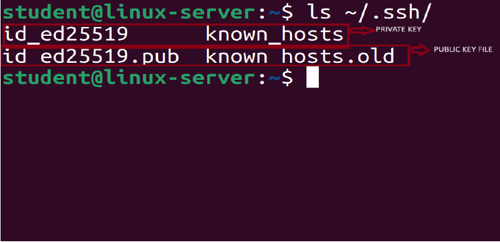
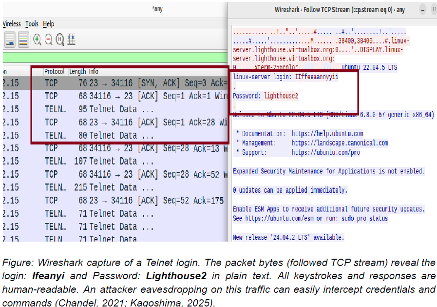
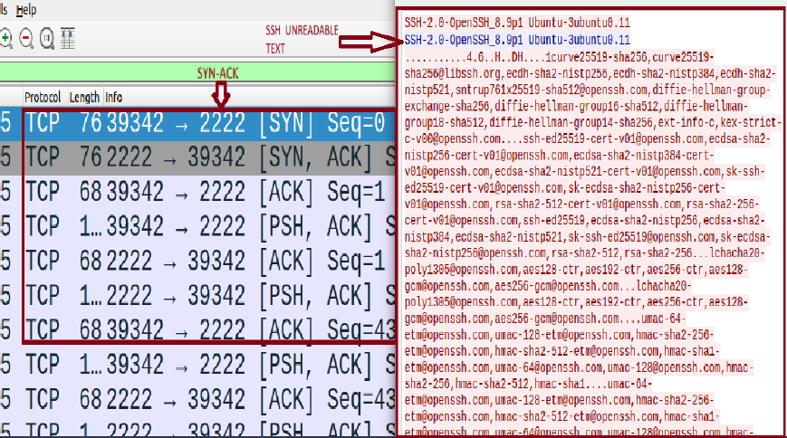
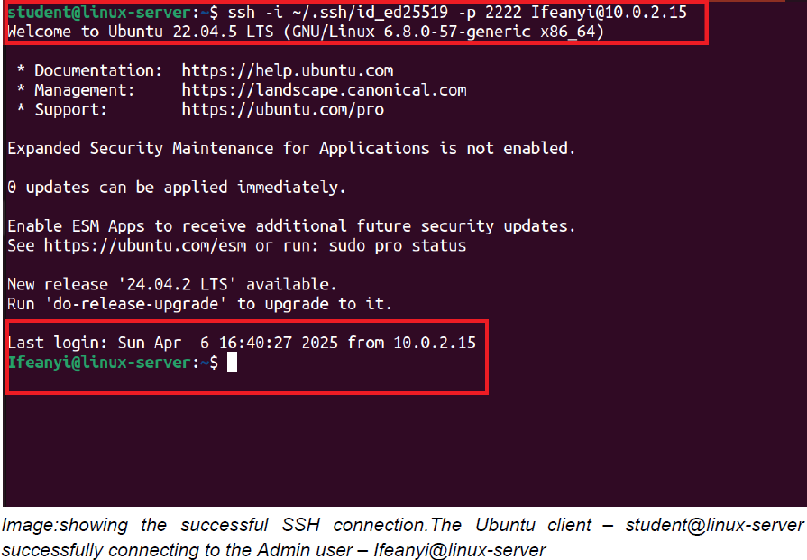

# SSH-for-Secure-and-Encrypted-Communication

##  Project Overview
This project demonstrates how I configured and hardened an **SSH server on Ubuntu Linux** to ensure secure, encrypted remote communication. The work included **key-based authentication, SSH hardening, custom port configuration, strong cipher enforcement, and session timeout controls** to reduce exposure to brute-force attacks, credential interception, and man-in-the-middle attempts.

I validated the configuration by analyzing **Telnet vs SSH traffic in Wireshark**, highlighting how SSH ensures confidentiality and integrity of data.

---

##  Summary of Work
- Installed and configured **OpenSSH server** on Ubuntu.
- Hardened SSH by:
  - Disabling root login.
  - Turning off password authentication.
  - Moving SSH from port 22 to 2222.
  - Enforcing strong encryption ciphers (AES256, ChaCha20, AES-CTR families).
  - Applying idle session timeouts (ClientAlive settings).
- Implemented **SSH key-based authentication** (Ed25519 keys).
- Captured and compared **Telnet (plaintext) and SSH (encrypted)** traffic with Wireshark.
- Produced a final hardened **`sshd_config`** for reuse across lab or production environments.

---

##  Methodology
I followed a structured, repeatable process:

1. **Install & Enable OpenSSH** – Confirmed service status and startup on boot.  
2. **Backup and Baseline Config** – Saved default `/etc/ssh/sshd_config` before changes.  
3. **Apply Hardening Controls** – Edited configuration to disable root/password logins, change port, restrict ciphers, and enforce session timeouts.  
4. **Deploy Key-Based Auth** – Generated Ed25519 key pair, installed public key, corrected permissions, and validated login using `ssh -i` and custom port.  
5. **Traffic Analysis** – Captured Telnet and SSH sessions in Wireshark; reviewed packet streams to illustrate plaintext vs encrypted traffic.  
6. **Validate & Document** – Restarted SSH, re-tested access, and documented the final secure configuration and mitigated attack vectors.

---

##  Outcomes
- Eliminated password brute-force exposure by **requiring key authentication**.
- Blocked direct privilege escalation vectors by **disabling root login** over SSH.
- Reduced noise from automated bots by **changing the default port**.
- Strengthened confidentiality and integrity of remote admin sessions with **modern ciphers**.
- Verified that sensitive data does **not traverse the network in plaintext**, unlike Telnet.
- Produced a **portable hardened SSH config** you can reuse in other labs or cloud builds.

---

##  Skills Gained
- SSH server installation and hardening on Linux.  
- Key-based authentication setup (Ed25519).  
- Cryptographic cipher selection and enforcement.  
- Wireshark packet capture and protocol comparison (Telnet vs SSH).  
- Mitigating brute-force, MITM, and credential interception risks.  
- Session timeout and access control tuning.  
- Secure remote administration best practices and documentation.

---

##  What I Learned
This project showed me how quickly a default SSH install can be hardened into a **secure remote access gateway** that stands up against common attack techniques. Comparing Telnet and SSH traffic at the packet level made the value of encryption obvious: credentials that were fully exposed under Telnet became unreadable under SSH. I also learned the importance of layered controls—turning off root and passwords, enforcing keys, restricting ciphers, and timing out idle sessions all work together to limit the attack surface.

---

## 📂 Project Files
- **[View Full Project Report (PDF)](docs/SSH_Encryption_Communication_on_Ubuntu_Linux_Virtual_Machine.pdf)**  
- **[View Final sshd_config File](docs/sshd_config_file.pdf)**  

---

## 🖼 Screenshots & Highlights

### 1. SSH Key Generation (Client)
  
*Ed25519 key pair created on the client; public key copied for server install.*

### 2. Telnet Plaintext Capture (Wireshark)
  
*Credentials visible in clear text during Telnet session capture — why Telnet is unsafe.*

### 3. SSH Encrypted Traffic (Wireshark)
  
*Packet payload unreadable; SSH session data protected by negotiated encryption.*

### 4. Successful SSH Connection

*Successful SSH connection.The Ubuntu client – student@linux-server successfully connecting to the Admin user – Ifeanyi@linux-server*

---

## 🔗 References
- [Mozilla OpenSSH Security Guidelines](https://infosec.mozilla.org)
- [NIST SP 800-123: Guide to General Server Security](https://csrc.nist.gov/publications/detail/sp/800-123/final)
- [Vultr SSH Hardening Docs](https://docs.vultr.com)
- [Wireshark User Guide](https://www.wireshark.org/docs/wsug_html_chunked/)
- [DigitalOcean SSH Key Setup Guide](https://www.digitalocean.com/community/tutorials)

---

## 👤 Author
**Ifeanyi Christian Edeh**  
Cybersecurity Specialist  
[LinkedIn Profile](https://www.linkedin.com/in/ifeanyiedeh)

